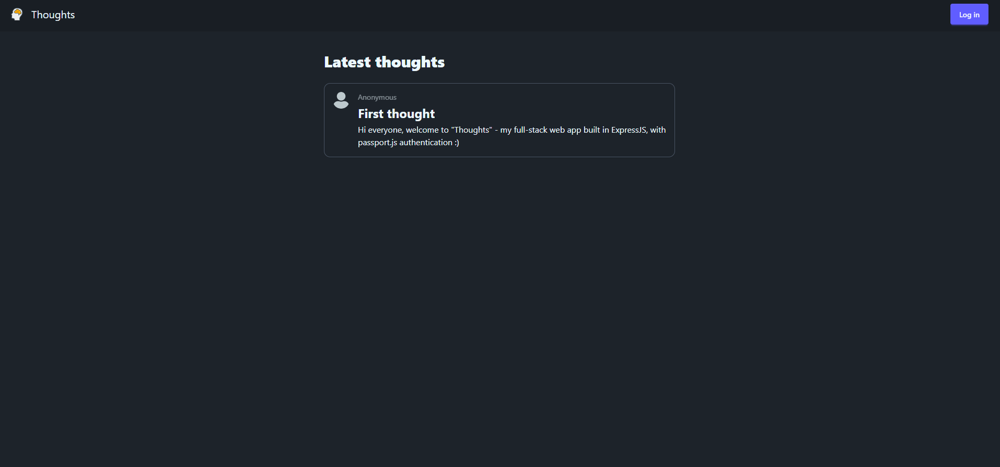
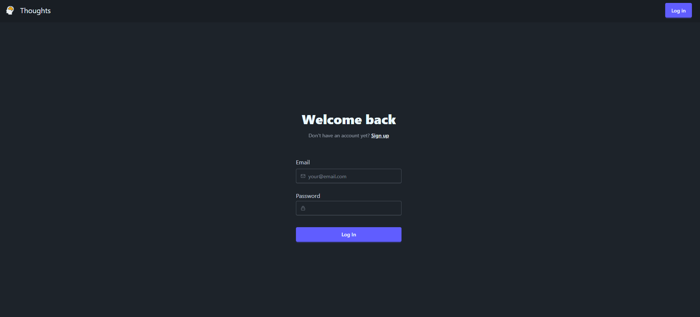

<!-- PROJECT SHIELDS -->

[![Issues][issues-shield]][issues-url]
![MIT License][license-shield]
[![LinkedIn][linkedin-shield]][linkedin-url]

<!-- PROJECT LOGO -->
 

  

<a href="https://adjacent-shawna-hl03-49893e7f.koyeb.app/" target="_blank"><h3 align="center">Thoughts</h3></a>

  

    Web app where users can sign up, share their thoughts, and optionally become members.
     
     
    <a href="https://adjacent-shawna-hl03-49893e7f.koyeb.app/" target="_blank">Live app</a> · 
    <a href="https://github.com/henrylin03/thoughts/issues/new" target="_blank">Add issue</a>
  

<!-- ABOUT THE PROJECT -->

## About

Full-stack web app, with authentication (`passportjs`), where users can sign up, log in, and share and view thoughts depending on their access level.

Built in Express.js (Node.js), with PostgreSQL database (`pg` integration with Express.js) and EJS templating. `passport.js` abstracts away a lot of the auth logic, which is supported by `express-sessions`.

This project is part of [The Odin Project's](https://www.theodinproject.com/) "Full Stack JavaScript" course.

## Screenshots

View of all thoughts:

Login page:

### Built with

   >)

## Licence

Distributed under MIT Licence.

<!-- MARKDOWN LINKS & IMAGES -->

[issues-shield]: https://img.shields.io/github/issues/henrylin03/thoughts.svg?style=for-the-badge
[issues-url]: https://github.com/henrylin03/thoughts/issues
[license-shield]: https://img.shields.io/github/license/henrylin03/thoughts.svg?style=for-the-badge
[linkedin-shield]: https://img.shields.io/badge/-LinkedIn-black.svg?style=for-the-badge&logo=linkedin&colorB=555
[linkedin-url]: https://www.linkedin.com/in/henrylin03/
